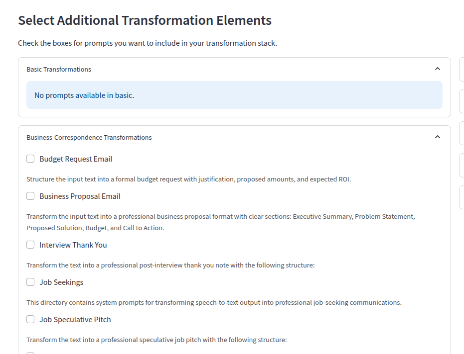

# Text-Transformation-Prompt-Combiner

A tool for combining system prompts designed for converting dictated text into various formats.

## Overview

This repository contains a collection of system prompts designed for transforming dictated text into various formats such as to-do lists, calendar entries, business communications, job applications, and more. The application provides a way to combine these prompts in a modular fashion to create customized text transformation instructions.

## Features

- Convert Markdown system prompts to JSON format
- Browse and select prompts by category and subcategory
- Combine multiple prompts into a single, cohesive system prompt
- Modern, web-based Streamlit interface for easy prompt selection and combination


## Demo





## Installation

1. Clone this repository:
   ```
   git clone https://github.com/danielrosehill/Text-Transformation-Prompt-Combiner.git
   cd Text-Transformation-Prompt-Combiner
   ```

2. Install the required dependencies:
   ```
   pip install -r requirements.txt
   ```

## Usage

### Streamlit Interface

To use the Streamlit interface:

```
python main.py
```

Or directly:

```
streamlit run app.py
```

The Streamlit interface provides a modern, web-based UI that allows you to:
- Browse prompts by category and subcategory
- Select multiple prompts to combine
- Preview the combined prompt
- Save the combined prompt to a file

## Methodology

The application uses a modular approach to combine system prompts:

1. **Basic Cleanup Prompt**: This is the foundational element that's always included by default.
2. **Additional System Prompts**: These can be included to enhance the specificity and effectiveness of the system prompts for particular use cases.

### How Prompt Combination Works

The prompt combination process follows these steps:

1. The basic cleanup prompt is applied as the foundation
2. Additional transformation layers are added based on your selections
3. The combined transformation prompt is created by merging these elements

### Structured Prompts

Some prompts require specific output formats (like JSON) and cannot be combined with other prompts. These are documented separately in [structured_prompts.md](structured_prompts.md).

## Project Structure

- `system-prompts/`: Directory containing all the Markdown system prompts
- `prompt_converter.py`: Utility for converting Markdown prompts to JSON
- `prompt_combiner.py`: Core module for combining system prompts
- `main.py`: Main entry point for the application
- `app.py`: Streamlit interface
- `structured_prompts.md`: Documentation for specialized structured prompts

## Adding New Prompts

To add new system prompts:

1. Create a new Markdown file in the appropriate category directory under `system-prompts/`
2. Follow the format of existing prompts with a title (H1) and content
3. Run the conversion tool to update the JSON database:
   ```
   python cli.py convert
   ```
